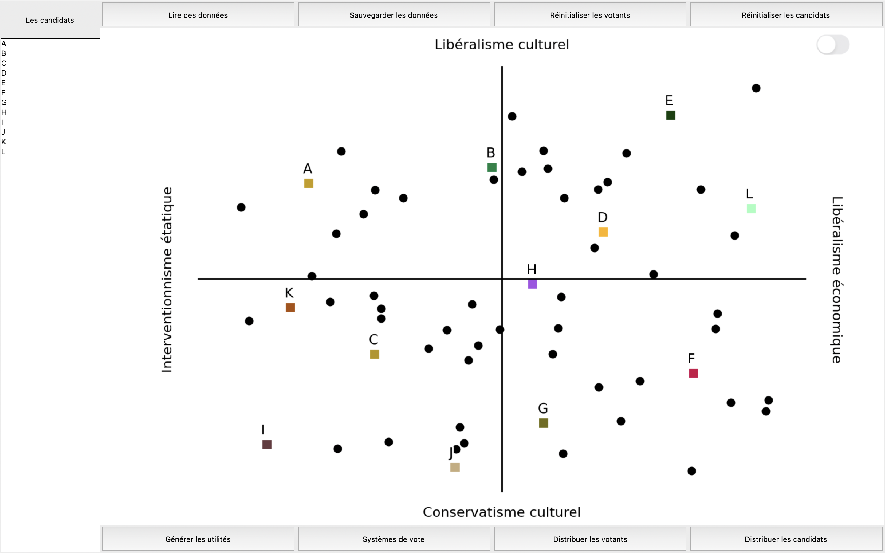

# Projet de Développement - LU2IN013

## Simulation Élections

_Ce repo est un clone de l'original sur GitLab, il ne contient pas les issues, pull requests, milestones et spring backlog._

_This repository is a clone of the original sur GitLab, it does not contain issues, pull requests, milestones and the sprint backlog._

["Original" repository](https://gitlab.com/zentek/elections) ([private](https://gitlabsu.sorbonne-universite.fr/lu2in013/fev2023/gr1/zentek/elections/))

| Nom      | Prénom | Numéro étudiant |
|----------|--------|-----------------|
| BATACHE  | Toufic | 21107810        |
| FARAH    | Karl   | 21108753        |
| HATOUM   | Nehmat | 21110397        |
| SIDDIQUE | Zahra  | 28725545        |

Supervisé par : MAUDET Nicolas, LEGAY Bastien

### Guide d'utilisation de l'interface

#### 1. Manipuler l'interface

1. Pour lancer l'interface, exécuter `python3.11 main.py`
2. Pour ajouter un votant, appuyer n'importe où sur le graphe.
3. Pour ajouter un candidat, maintenir le bouton shift enfoncé et appuyer n'importe où sur le graphe.
4. Pour réinitialiser tous les votants, appuyer sur le bouton `Réinistialiser les votants`.
5. Pour réinitialiser tous les candidats, appuyer sur le bouton `Réinistialiser les candidats`.
6. Pour lire des données d'un fichier csv, suivre le guide [2](#2-lire-des-données-dun-fichier-csv).
7. Pour sauvegarder des données sur le graphe dans un fichier csv, appuyer sur le bouton `Sauvegarder les données`.
8. Pour afficher/masquer les numéros des votants, appuyer sur le bouton de commutation qui se trouve au-dessous de `Réinistialiser les candidats`.
9. Pour distribuer les candidats/votants, appuyer sur le bouton `Distribuer les candidats/votants` correspondant. Indiquer le nombre de candidats/votants à distribuer ou laisser vide pour les valeurs par défaut. 
Puis choisir soit la distribution uniforme, soit celle gaussienne. Si le choix est la distribution uniforme, les candidats/votants s'affichent uniformément sur le graphe.
Si le choix est la distribution gaussienne, tous les boutons sont désactivés et il faut appuyer sur le graphe à l'endroit qui correspondera au sommet de la gaussienne.
10. Pour visualiser les régles de vote, suivre le guide [3](#3-visualiser-les-systèmes-de-votes).
11. Pour visualiser les utilités des candidats, appuyer sur le bouton `Générer les utilités`.
12. Pour modifier le nom ou la couleur d'un candidat, le sélectionner dans la fenêtre à droite et double-cliquez dessus. Procéder à modifier le nom et/ou la couleur.

#### 2. Lire des données d'un fichier csv
1. Appuyer sur le bouton `Lire les données`. Le format à suivre pour obtenir un fichier valable s'affiche.
2. Choisir le fichier csv à importer et l'ouvrir.

Si le fichier choisi suit le format indiqué, aucune erreur ne s'affiche et les candidats et/ou les votants présents dans le fichier s'affichent sur le graphe.
Sinon, un message s'affiche indiquant le type de l'erreur et sa ligne. Veuiller les corriger avant de réessayer.

#### 3. Visualiser les systèmes de votes
Une fois des candidats et des votants sont présents sur le graphe, suivre les instructions suivantes pour obtenir les résultats selon les différents systèmes de vote:
1. Appuyez sur le bouton `Systèmes de vote`. Les différents modes de vote s'affichent.
2. 3 possibilités se présentent:
   1. Visualiser une règle de vote en appuyant sur son bouton correspondant. Une fenêtre s'affiche. Pour voir la description de cette règle, appuyer sur le bouton ⓘ. Pour voir le détail des résultats, appuyer sur le bouton en haut à gauche.
   2. Visualiser plusieurs règles de vote simultanément sans détails en appuyant sur le bouton `Modes combinés`.
   3. Visualiser la démocratie liquide en appuyant sur le bouton `Démocratie liquide`.
    

