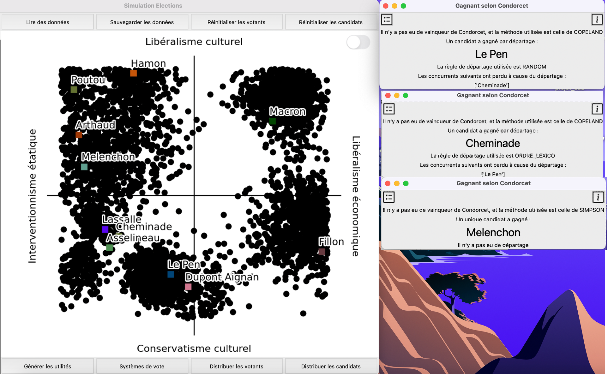
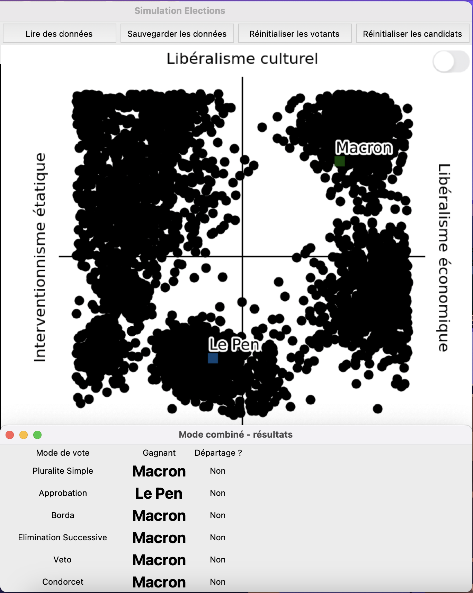
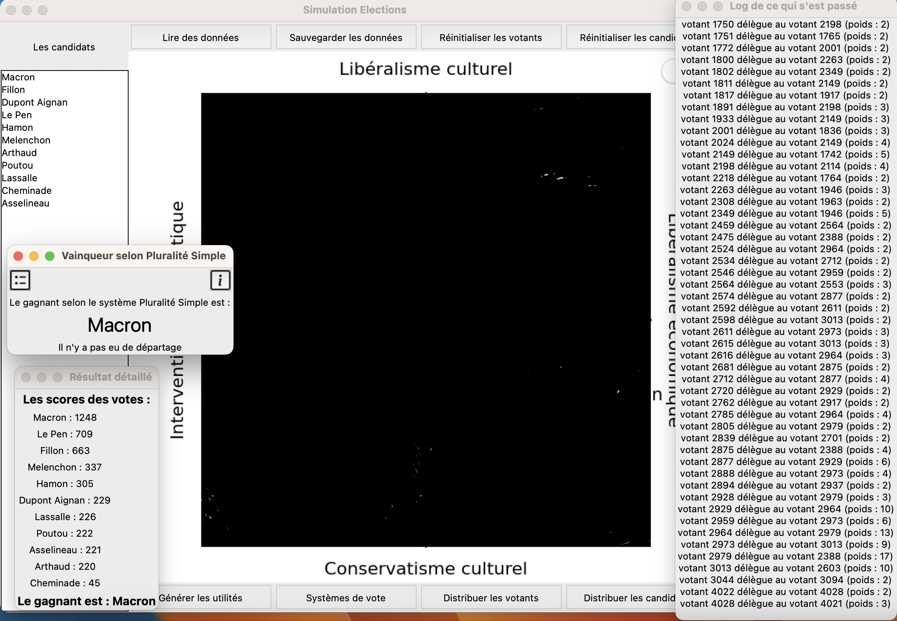
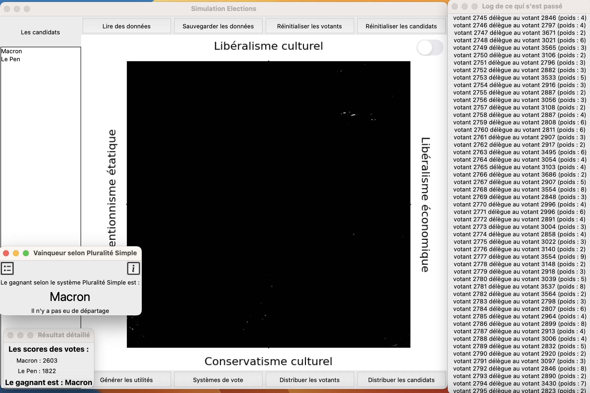
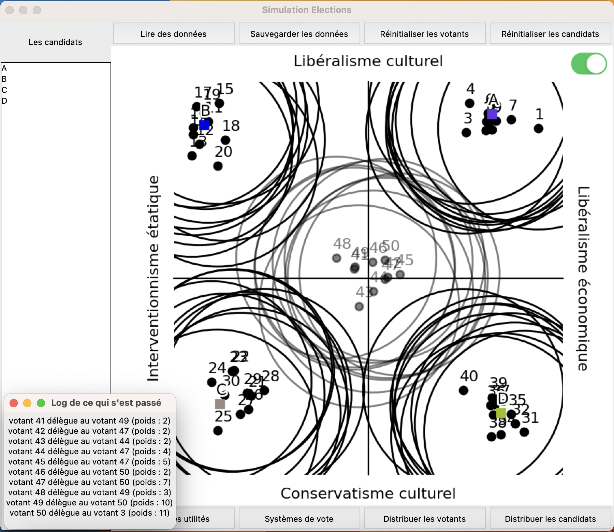

# LU2IN013 - Projet Élections 
## Rendu - Mini sprint

### Données
1. En reprenant les résultats de l'élection présidentielle de 2017 en France, et en considérant le placement des candidats donné par la boussole présidentielle de cette même année (voir les données plus bas), vous chercherez à __trouver une distribution des votants qui produise ces résultats__ (sans contrainte sur leur nombre).

2. On envisage une nouvelle règle de vote inspirée de la __démocratie liquide__: si un votant n'est pas assez proche d'un candidat, il décide avec une certaine probabilité de déléguer son (ou ses) vote(s)  au votant le plus proche qui n'a pas déjà délégué son ou ses vote(s). On itère pendant un nombre de tours et à la fin de la procédure on procède au vote, selon la règle de pluralité. Chaque votant dispose alors d'un poids qui correspond aux votes cumulés qu'il a pu recevoir, tandis que les votants ayant délégué leur vote ne participent pas. Les paramètres de cette nouvelle "règle" sont donc: la distance à partir de laquelle un votant considère déléguer son vote, la proba de déléguer son vote, et enfin le nombre de tours à effectuer avant le vote. 

3. Testez __ce que donneraient les résultats des différentes règles de votes__ (déjà implémentées, et de démocratie liquide) sur la distribution trouvée pour le 1. Pour la règle de démocratie liquide, vous pourrez fixer le paramètre de distance à partir duquel la délégation est envisagée, puis effectuer une analyse en fonction de la probabilité et du nombre de tours avant de procéder au vote, par exemple en donnant une heatmap avec les résultats (le vainqueur) en fonction de ces deux paramètres. 

### Guides
#### 1. Manipuler l'interface

1. Pour ajouter un votant, appuyer n'importe où sur le graphe.
2. Pour ajouter un candidat, maintenir le bouton shift enfoncé et appuyer n'importe où sur le graphe.
3. Pour réinitialiser tous les votants, appuyer sur le bouton `Réinistialiser les votants`.
4. Pour réinitialiser tous les candidats, appuyer sur le bouton `Réinistialiser les candidats`.
5. Pour lire des données d'un fichier csv, suivre le guide [2](#2-lire-des-données-dun-fichier-csv).
6. Pour sauvegarder des données sur le graphe dans un fichier csv, appuyer sur le bouton `Sauvegarder les données`.
7. Pour afficher/masquer les numéros des votants, appuyer sur le bouton de commutation qui se trouve au-dessous de `Réinistialiser les candidats`.
8. Pour distribuer les candidats/votants, appuyer sur le bouton `Distribuer les candidats/votants` correspondant. Indiquer le nombre de candidats/votants à distribuer ou laisser vide pour les valeurs par défaut. 
Puis choisir soit la distribution uniforme, soit celle gaussienne. Si le choix est la distribution uniforme, les candidats/votants s'affichent uniformément sur le graphe.
Si le choix est la distribution gaussienne, tous les boutons sont désactivés et il faut appuyer sur le graphe à l'endroit qui correspondera au sommet de la gaussienne.
9. Pour visualiser les régles de vote, suivre le guide [3](#3-visualiser-les-systèmes-de-votes).
10. Pour modifier le nom ou la couleur d'un candidat, le sélectionner dans la fenêtre à droite et cliquez dessus. Procéder à modifier le nom et/ou la couleur.

#### 2. Lire des données d'un fichier csv
1. Lancer l'interface en exécutant `python3.11 main.py`
2. Appuyer sur le bouton `Lire les données`. Le format à suivre pour obtenir un fichier valable s'affiche.
3. Choisir le fichier csv et l'ouvrir.

Si le fichier choisi suit le format indiqué, aucune erreur ne s'affiche et les candidats et/ou les votants présents dans le fichier s'affichent sur le graphe.
Sinon, un message s'affiche indiquant le type de l'erreur et sa ligne. Veuiller les corriger avant de réessayer.

#### 3. Visualiser les systèmes de votes
Une fois des candidats et des votants sont présents sur le graphe, suivre les instructions suivantes pour obtenir les résultats selon les différents systèmes de vote:
1. Appuyez sur le bouton `Systèmes de vote`. Les différents modes de vote s'affichent.
2. 3 possibilités se présentent:
   1. Visualiser une règle de vote en appuyant sur son bouton correspondant. Une fenêtre s'affiche. Pour voir la description de cette règle, appuyer sur le bouton ⓘ. Pour voir le détail des résultats, appuyer sur le bouton à haut à gauche.
   2. Visualiser plusieurs règles de vote simultanément sans détails en appuyant sur le bouton `Modes combinés`.
   3. Visualiser la démocratie liquide en appuyant sur le bouton `Démocratie liquide`.
    

### Réponses

1. La distribution des votants qui produit les résultats de l'élection présidentielle de 2017 se trouve dans les fichiers suivants:
[mini_sprint_candidats_votants_2017_tour1.csv](files%2Fmini_sprint_candidats_votants_2017_tour1.csv)
[mini_sprint_candidats_votants_2017_tour2.csv](files%2Fmini_sprint_candidats_votants_2017_tour2.csv) \
Pour les visualiser sur notre interface, suivre les étapes mentionnées dans les guides.

2. Cette question est fait dans le code. Vérifier les commits précédents.

3. Voici les résultats des différentes règles de vote sur la distribution trouvée en 1:
   (Pour Borda et Approbation, on a adopté les valeurs par défaut)

    TOUR 1:
    
    
    TOUR 2:
    
    Pour les visualiser avec les détails de chacun, suivre le guide [3](#3-visualiser-les-systèmes-de-votes).
    
    Exemple de la démocratie liquide sur les élections de 2017: \
    TOUR 1:
    

    TOUR 2:
    

    Exemple de la démocratie liquide:
    

